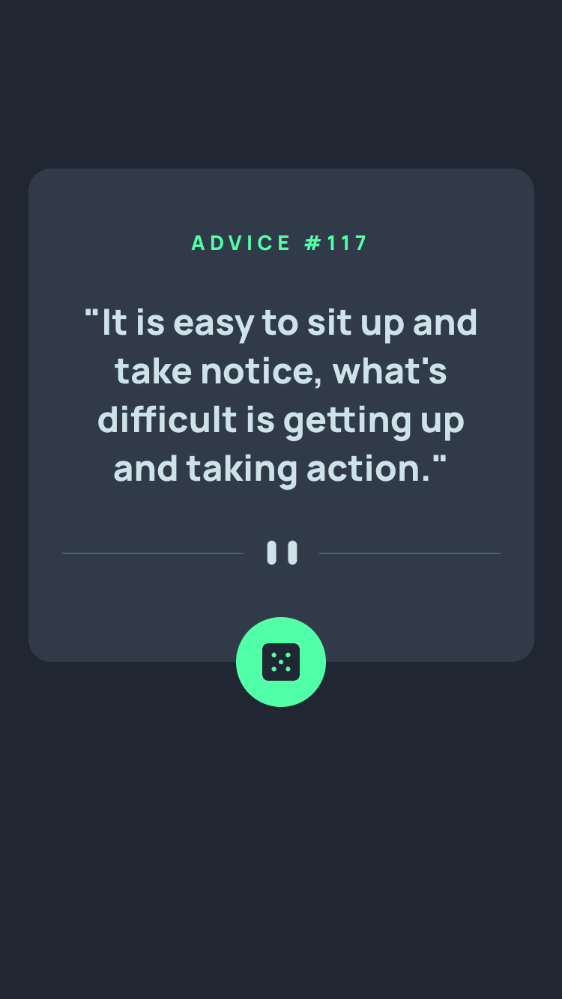
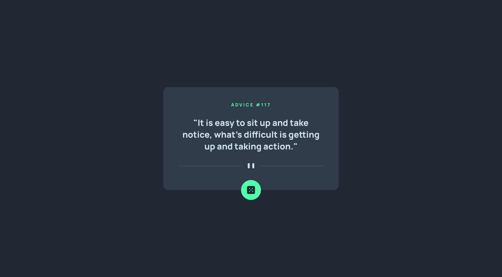

# Advice generator app

This is a solution to the [Advice generator app challenge on Frontend Mentor](https://www.frontendmentor.io/challenges/advice-generator-app-QdUG-13db).

## Overview

### The challenge

Users should be able to:

- View the optimal layout for the app depending on their device's screen size
- See hover states for all interactive elements on the page
- Generate a new piece of advice by clicking the dice icon

### Screenshot

Mobile             |  Desktop
:-------------------------:|:-------------------------:
  |  

### Links

- Live Site URL: [Advice Generator](https://rococo-squirrel-c4778f.netlify.app/)

## My process

### Built with

- HTML
- React
- Sass
- API call
- Mobile-first workflow

### What I learned

The key learning point in this challenge was using Mobile-first workflow and rendering different images based on device size. It was also a good opportunity to revise functional components and basic state management in React. Overall, an easy and fun challenge :)

## Author

- Github - [jane-doronina](https://github.com/jane-doronina)
- LinkedIn - [@zhanna-doronina](https://www.linkedin.com/in/zhanna-doronina/)
